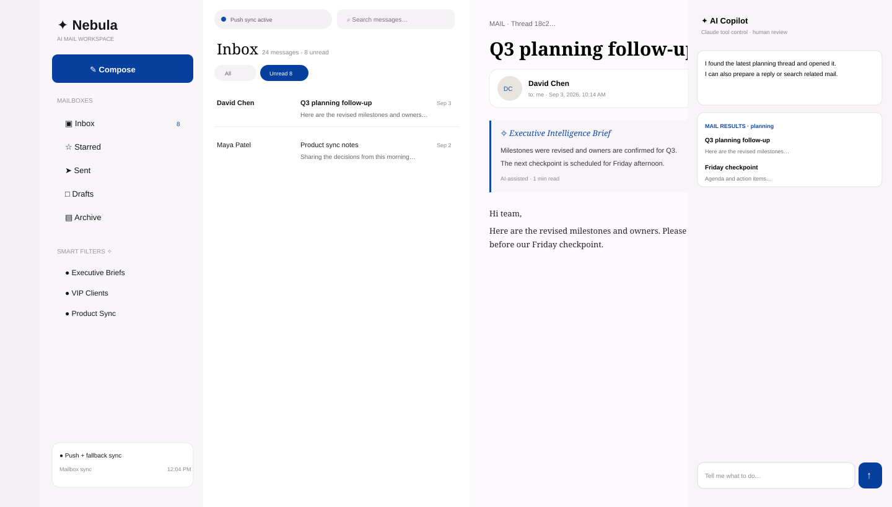

# Nebula Mail — AI-Powered Gmail Workspace

Nebula Mail is a Gmail-connected workspace where an AI Copilot **controls visible application state** instead of returning chat-only answers. It follows the supplied Nebula design while using real Gmail APIs.

## Implemented

- Google OAuth 2.0 with cryptographically random CSRF `state` validation.
- Real Gmail Inbox, Sent, Drafts, Starred and Archive views.
- Gmail search syntax for keyword, sender, unread and date filters.
- Pagination with a Load older messages control (50-message pages).
- Conversation/thread view backed by Gmail `threads.get`.
- Compose, reply, reply-all and forward.
- Explicit **Review & Send → Confirm & Send** human-in-the-loop flow.
- Claude tool calling for compose, search, navigation and contextual replies when `ANTHROPIC_API_KEY` is configured.
- Safe deterministic fallback when Claude is unavailable; fallback responses are not presented as AI-generated.
- Rich mail result cards inside the Copilot panel.
- Gmail Pub/Sub push support with `watch`, webhook handling and `history.list` incremental-change detection when `PUBSUB_TOPIC` is configured.
- 30-second polling remains as a reliability fallback.
- Sync diagnostics showing push/polling mode, history ID, watch expiry and fallback interval.
- Responsive Nebula-style UI, dark mode, authentication/empty/error states.
- Automated Node tests and GitHub Actions CI.

## Architecture

```text
Browser SPA
  ├─ Inbox / thread reader / compose / Copilot
  ├─ Server-Sent Events for push refresh
  └─ 30s fallback refresh
          │
          ▼
     Express server
  ┌───────┼─────────────┐
  │       │             │
OAuth   Gmail API    Claude API
  │       │             │
  │       ├─ messages / threads / history
  │       └─ watch → Google Cloud Pub/Sub → /api/gmail/webhook
  └─ server-side session token storage
```

## AI Copilot

With `ANTHROPIC_API_KEY`, the server calls Claude's Messages API with structured tools:

- `compose_email` — fills a draft; never sends it.
- `search_mail` — executes Gmail search and returns clickable result cards.
- `navigate_mail` — changes the visible folder.
- `prepare_reply` — prepares a contextual reply using the open message.

The Anthropic key is server-side only. If Claude is unavailable, the small deterministic fallback keeps basic navigation/filtering usable and explicitly says that Claude is not active.

## Real-time sync

**Push mode:** set `PUBSUB_TOPIC` to a fully qualified Google Cloud Pub/Sub topic. Authenticated startup creates/renews a Gmail `watch`; Pub/Sub notifications reach `/api/gmail/webhook`; Gmail history is inspected and an SSE event refreshes the browser.

**Fallback mode:** without Pub/Sub configuration the browser refreshes every 30 seconds. Even in push mode the fallback remains enabled so a missed push cannot silently leave the mailbox stale.

The UI says **“Push sync active”** only when push mode is configured. Otherwise it says **“Auto-refreshing every 30s”**.

### Pub/Sub setup

1. Enable Gmail API and Cloud Pub/Sub in Google Cloud.
2. Create a Pub/Sub topic such as `projects/YOUR_PROJECT/topics/gmail-events`.
3. Grant `gmail-api-push@system.gserviceaccount.com` permission to publish to the topic.
4. Create a push subscription targeting `https://YOUR_HOST/api/gmail/webhook`.
5. Set `PUBSUB_TOPIC` in `.env`.
6. Optionally set `PUBSUB_VERIFICATION_TOKEN` and append `?token=...` to the push URL.
7. Open Sync Diagnostics after login to verify watch expiry and mode.

## Local setup

Requirements: Node.js 18+.

```bash
cp .env.example .env
npm install
npm test
npm start
```

Open `http://localhost:3000` and choose **Continue with Google**.

### Environment

```text
PORT=3000
NODE_ENV=development
SESSION_SECRET=replace-with-a-long-random-secret
GOOGLE_CLIENT_ID=...
GOOGLE_CLIENT_SECRET=...
GOOGLE_REDIRECT_URI=http://localhost:3000/auth/callback
ANTHROPIC_API_KEY=...                 # optional; enables Claude tool calling
ANTHROPIC_MODEL=claude-sonnet-4-6     # optional
PUBSUB_TOPIC=projects/.../topics/...  # optional push mode
PUBSUB_VERIFICATION_TOKEN=...         # optional webhook verification
POLL_INTERVAL_SECONDS=30
```

## Screens / design evidence



The implementation covers the supplied design states for authentication/onboarding, empty search, token-expiration/error handling, compose, AI confirmation, AI Copilot and sync diagnostics.

## Security and reliability

- OAuth callbacks verify a per-session `state` value.
- OAuth tokens are never exposed to browser JavaScript.
- Email content is escaped and displayed as plain text instead of injecting arbitrary HTML.
- Sending requires form validation plus an explicit second confirmation action.
- Archive uses Gmail search (`-label:inbox -label:trash -label:spam`) rather than an invalid `ARCHIVE` label ID.
- Gmail history IDs are tracked for push refreshes; 30-second fallback refresh is the recovery path if history/push delivery is unavailable.
- Session storage is in-memory for the assessment. A production deployment should use encrypted persistent session/token storage and a shared state/event store for multiple instances.

## Tests and CI

Run `npm test` locally. GitHub Actions runs the same suite on pushes and pull requests to `main`.

The tests cover Gmail normalization, multipart body extraction, search construction, Archive semantics and unauthenticated API protection.

## Hiring-task coverage

| Requirement | Status |
|---|---|
| Gmail integration | Implemented |
| Inbox + Sent | Implemented |
| Compose + send | Implemented |
| Natural-language UI control | Claude tool calling + safe fallback |
| Search/filter UI mutation | Implemented |
| Contextual reply | Implemented |
| Human confirmation before send | Implemented |
| Thread/conversation view | Implemented |
| Copilot rich result previews | Implemented |
| Push sync | Implemented when Pub/Sub is configured |
| Polling fallback | Implemented |
| OAuth CSRF state | Implemented |
| Pagination | Implemented |
| Automated tests | Implemented |
| CI | Implemented |
| Live deployment | Not claimed; requires deployment infrastructure |

## Production boundary

This is an assessment-ready application, not a claim of a fully operated SaaS platform. Persistent encrypted OAuth/session storage, multi-instance shared event delivery, managed secrets, observability and an HTTPS deployment belong in the deployment layer. The core code paths for push sync, Claude tools, pagination, thread views and human confirmation are implemented rather than left as README-only TODOs.
